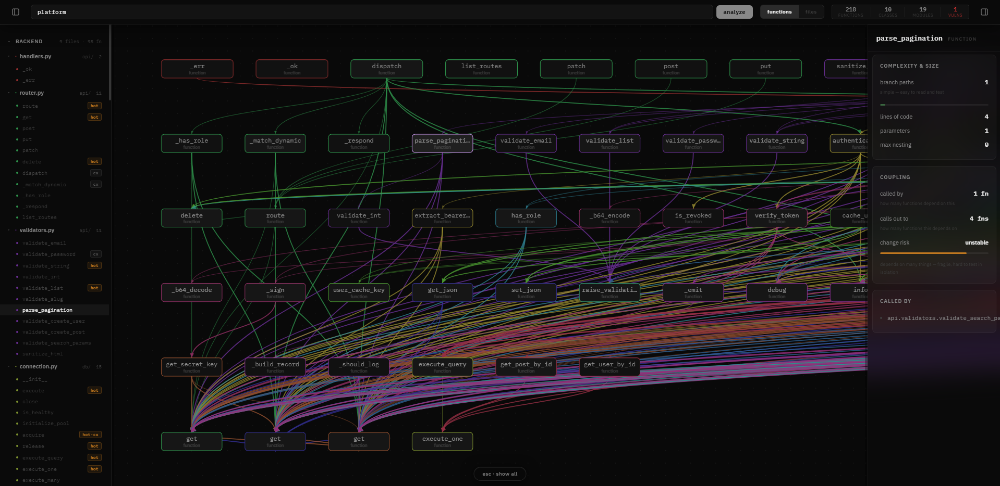
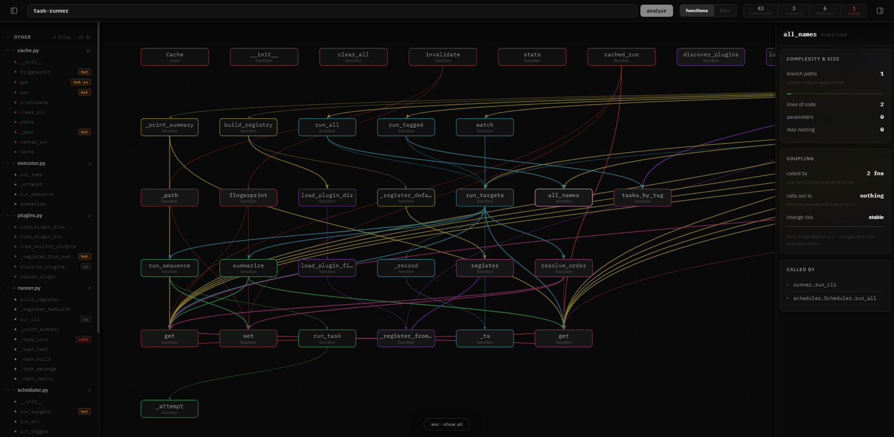

# ArchLens

> Codebase intelligence — visualize architecture as an interactive dependency graph.

ArchLens parses your entire codebase and renders it as a live, navigable graph. See how modules depend on each other, identify architectural layers, and understand unfamiliar codebases in minutes.





## Features

- **Multi-language parsing** — Python, Go, TypeScript, and more via a Rust/tree-sitter engine
- **Interactive graph** — canvas-rendered dependency graph with click-through node inspection
- **Layer segregation** — automatic Frontend / Backend / Shared classification
- **Git metadata** — branch, commit, and remote info surfaced per repo
- **Fast** — analysis runs in Rust; the frontend never blocks

## Tech Stack

| Layer | Technology |
|-------|-----------|
| Parser / Engine | Rust + tree-sitter |
| API Server | Rust + Axum |
| Frontend | React 19 + TypeScript + Vite |
| Graph Rendering | Canvas + HTML overlay |

## Getting Started

**Prerequisites:** Rust (stable), Node.js 18+

```bash
# 1. Build the Rust workspace
cargo build --release

# 2. Install frontend dependencies
cd frontend && npm install

# 3. Start everything (API + dev server)
npm run dev
```

Open `http://localhost:5173`, enter an absolute path to any local repo, and hit **analyze**.

## Usage

```
/api/analyze?path=/absolute/path/to/your/repo
```

The server walks the directory, skips `node_modules`, `venv`, and dotfiles, then returns a full dependency graph as JSON.
